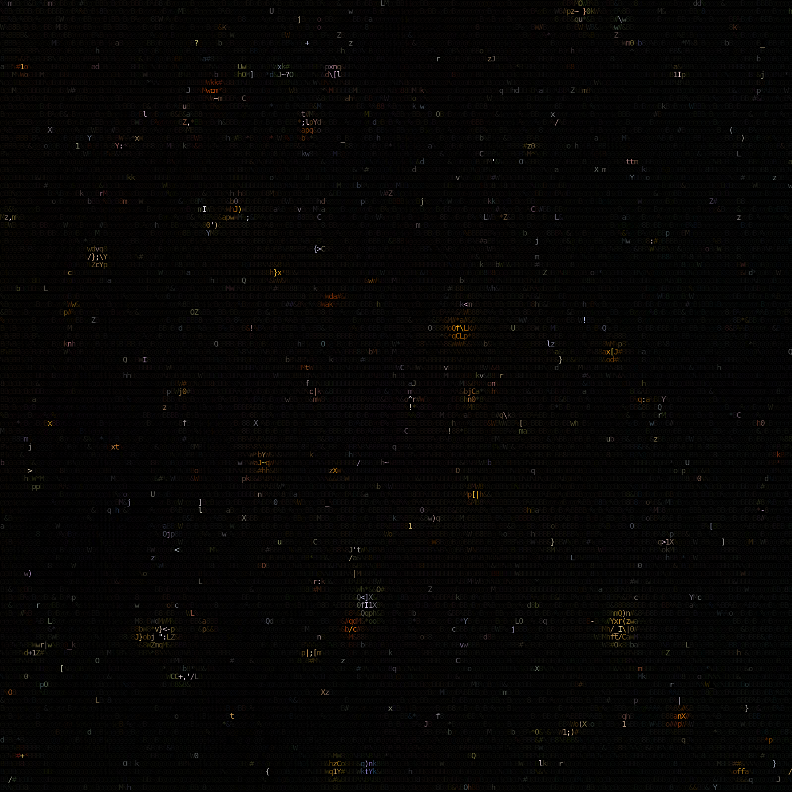

<!--

### Hi there 👋

**sphhh/sphhh** is a ✨ _special_ ✨ repository because its `README.md` (this file) appears on your GitHub profile.

Here are some ideas to get you started:

- 🔭 I’m currently working on myself;
- 🌱 I’m currently learning C/C++ and Rust;
- 👯 I’m looking to collaborate on computer science;
- 🤔 I’m looking for help with my C projects O_o;
- 💬 Ask me about anything;
- 📫 How to reach me: you can't;
- 😄 Pronouns: she/her;
- ⚡ Fun fact: I play league, somethimes;
-->

  
  

